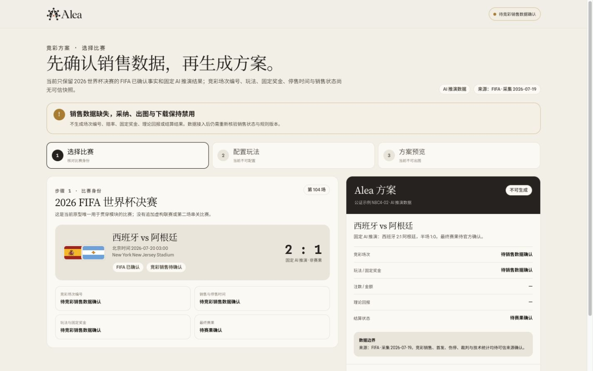
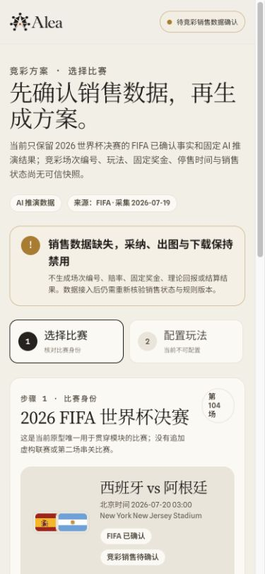
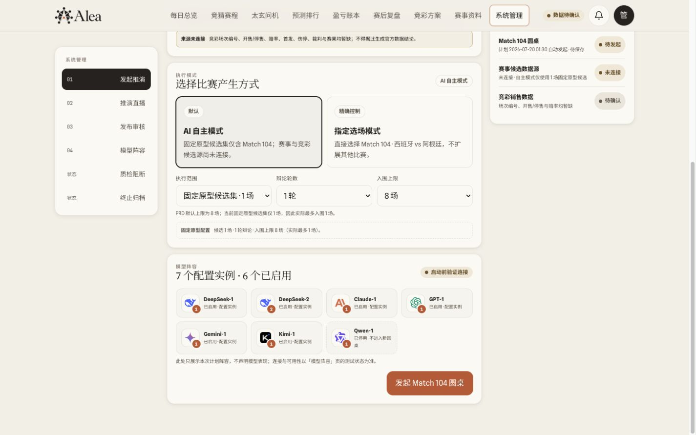
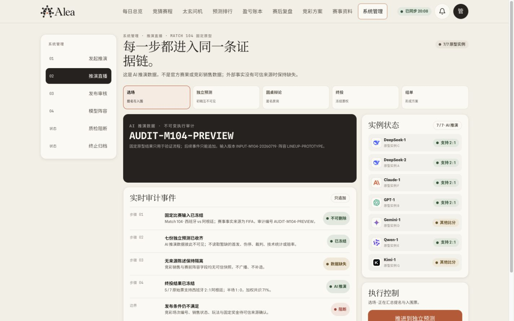
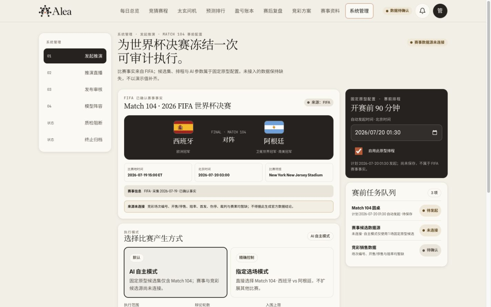
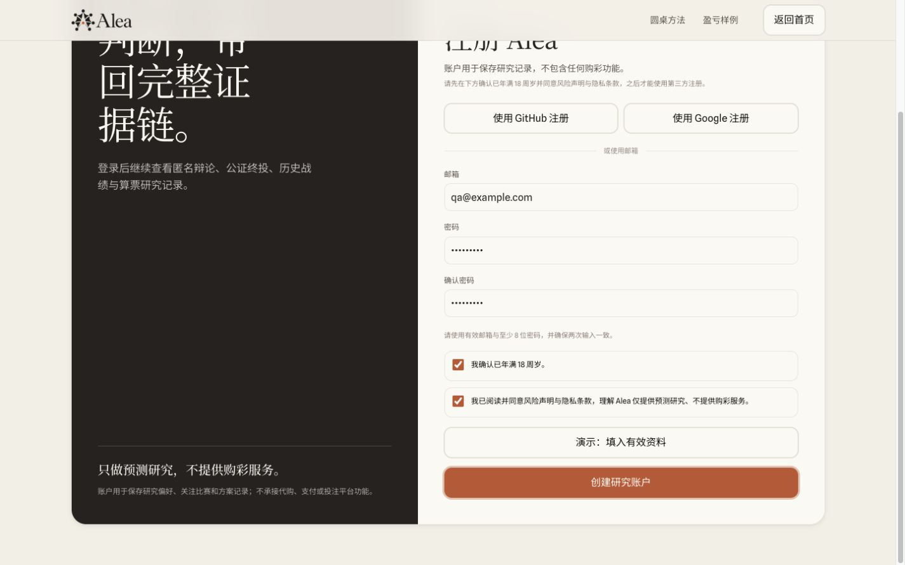
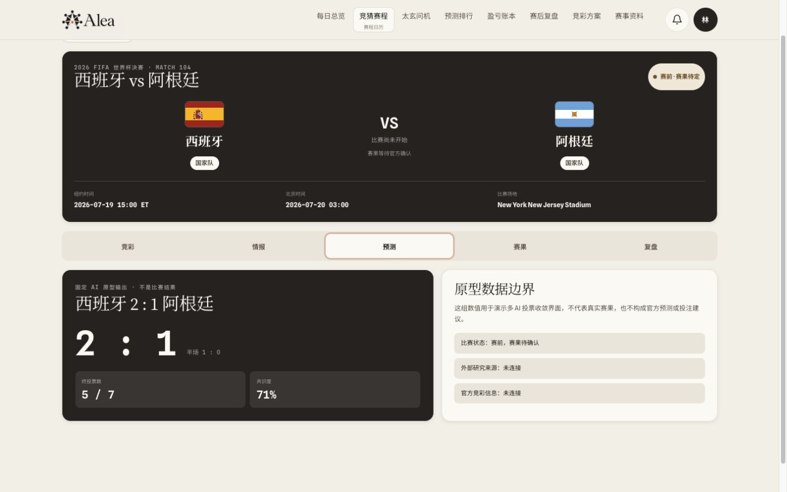
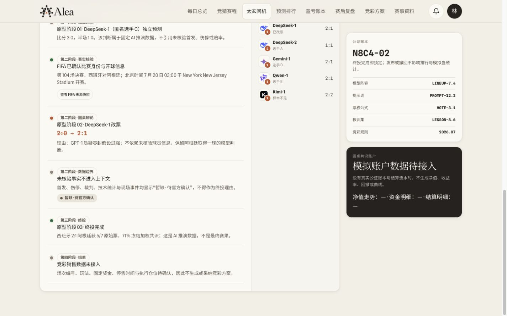
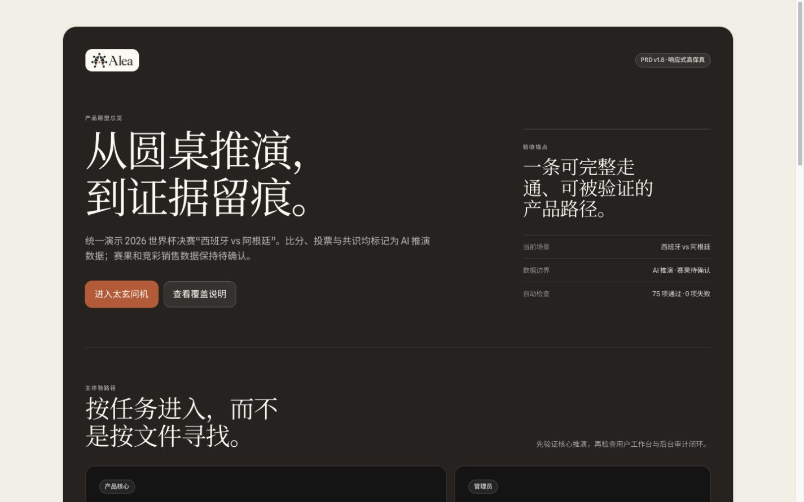

# Alea OpenDesign 原型视觉验证报告

验证日期：2026-07-19  
产品依据：`docs/产品需求文档.md` v1.9  
原型路径：`/Users/aa/Library/Application Support/Open Design/namespaces/release-stable/data/projects/c73b3011-35b7-4a7a-a8e9-a22f12257c20`  
验收视口：桌面 `1440 × 900`；移动 `390 × 844`

## 结论

原型的视觉完成度较高，统一的暖色视觉系统、信息层级、缺失数据表达、推演回放、终止归档和模型阵容配置均已达到高保真水平；但本轮不能通过 PRD v1.9 的完整视觉验收。

- P0 主链存在 3 个阻断项：缺少隔离的「采用 → 配置 → 出图/分享」交互样例；冻结阵容与实际圆桌参与者不一致；移动端用户控制台缺少全局导航。
- P1 管理后台覆盖不完整：数据管理、系统设置、推演方法/方法评审没有可到达页面。
- 另有 3 个非阻断问题：深链接首屏被固定导航遮挡；公证证据版本字段展示不完整；原型入口仍标记 PRD v1.8。

本轮共记录 20 个视觉步骤：9 个良好、5 个局部异常、6 个失败。静态校验脚本退出码为 `0`，结果为 `PASS 75 / FAIL 0`；静态校验不能替代上述真实渲染和交互问题。

## 需要处理的问题

### 1. P0 阻断：缺少与事实场景隔离的「采用 → 出图」交互样例

PRD §5.3、§18 明确允许并要求为 P0 主链提供独立状态，显著标注 `交互样例 · 非体彩 SP`，用于验证采用、配置、出图和分享。当前桌面与移动计算器都只有真实数据缺失时的锁定态，采纳、配置、出图和下载均不可用；原型文件中也不存在该标签。

锁定态本身是正确的，但它不能同时承担 P0 交互验证。





### 2. P0 阻断：启动前冻结阵容与圆桌实际参与者矛盾

发起推演页显示「7 个配置实例 · 6 个已启用」，并明确标记 `Qwen-1 已停用 · 不进入新圆桌`。实际点击发起后，直播页却显示 `7/7 原型实例`，Qwen-1 进入圆桌并参与最终投票；用户预测卡和辩论回放也继续把 Qwen-1 计入 5/7 票。

这会破坏冻结阵容、法定人数、投票分母和公证证据的一致性。





### 3. P0 阻断：390 × 844 用户控制台没有全局导航

移动端太玄问机和竞彩方案的顶部只保留品牌、消息和头像入口；桌面主导航在窄屏隐藏后，没有汉堡菜单、底部导航或等价的模块入口。头像菜单只含个人设置，不提供每日总览、赛程、排行、账本、复盘、方案或资料导航。

PRD §4 定义的控制台信息架构因此在移动端无法到达，§18 第 12 项的移动核心场景也无法形成跨模块闭环。


### 4. P1 覆盖阻断：系统管理关键页面缺失

直接访问 `#sync`、`#settings`、`#methodology` 和 `#users` 均落回 `#launch`。当前系统管理只提供发起推演、推演直播、发布审核、模型阵容、质检阻断和终止归档。

因此 PRD §15.5–§15.7、§18 第 16–17 项中的以下内容尚无法视觉验证：

- 数据管理、同步日志、失败重试和赛果冲突裁定；
- 评分权重、竞彩规则、模拟盘参数、数据同步周期、定时圆桌、自动复盘；
- `history_context_limits` 的 10 场/5 条默认值、范围和版本化保存；
- 用户管理；
- 提示词版本、推演方法、回测、方法评审、确认发布与版本回滚。



### 5. 中等：深链接首屏被固定导航遮挡

从正式入口进入注册、每日总览和比赛详情时，页面保留了非零滚动位置或未为固定导航设置锚点偏移，导致首屏标题或返回入口被遮挡。

- 注册页：`注册 Alea` 标题及左侧主文案顶部被裁切；
- 每日总览：`世界杯决赛，等待开球。` 的第一行被遮挡；
- 比赛详情：`返回赛程列表` 只剩一个被裁切的空白胶囊。






### 6. 中等：公证证据的版本追溯字段展示不完整

当前公证证据卡展示了模型阵容、提示词、票权公式、教训集和竞彩规则，但没有可见的模型/连接版本、输出 Schema、工具合同、输入数据版本、历史上下文版本和实际注入记录。页面也没有通往更完整公证账本详情的入口。

这不足以视觉验证 PRD §1.4、§17.4、§17.13 要求的完整上下文还原能力。



### 7. 低：原型入口仍声明 PRD v1.8

原型总入口顶部明确显示 `PRD v1.8 · 响应式高保真`，而正式 PRD 已是 v1.9。该标签会让评审者误判当前原型覆盖的需求基线。



## 逐步验证记录

| 步骤 | 操作与目标 | 观察结果 | 健康度 | 证据 |
|---:|---|---|---|---|
| 1 | 打开原型总入口 | 页面完整、入口清晰；版本标签仍为 PRD v1.8 | 局部异常 | [01](screenshots/01-prototype-index-desktop.png) |
| 2 | 打开营销首页 | 2:1、5/7、71% 与数据来源表达一致，层级和动效舞台完整 | 良好 | [02](screenshots/02-marketing-home-desktop.png) |
| 3 | 进入注册页，使用演示按钮填入有效资料 | 18 岁与条款门控正确，提交按钮按条件启用；首屏标题被遮挡 | 失败 | [03](screenshots/03-signup-valid-desktop.png) |
| 4 | 进入每日总览 | 焦点赛事、数据边界和卡片层级清晰；页面标题被固定导航遮挡 | 失败 | [04](screenshots/04-console-overview-desktop.png) |
| 5 | 在赛程列表使用日期/状态筛选，打开决赛详情并切换到预测 Tab | 筛选和 Tab 可用，详情内容正确；返回入口被遮挡 | 局部异常 | [05](screenshots/05-fixture-detail-prediction-desktop.png) |
| 6 | 打开太玄问机今日推演 | 当前事实、AI 推演与竞彩缺失态区分清楚；证据字段和冻结阵容一致性有缺口 | 局部异常 | [06](screenshots/06-today-prediction-desktop.png) |
| 7 | 展开辩论回放，并打开 AI 依据详情 | 五阶段回放、来源与缺失边界清晰；完整版本追溯字段不足 | 局部异常 | [07](screenshots/07-debate-replay-desktop.png) |
| 8 | 打开预测卡生命周期样例 | 未来状态与当前事实通过「组件状态样例」明确隔离 | 良好 | [08](screenshots/08-prediction-lifecycle-desktop.png) |
| 9 | 打开桌面竞彩方案 | 真实销售数据缺失时禁用配置、采纳和出图，事实态正确；P0 交互样例缺失 | 失败 | [09](screenshots/09-calculator-locked-desktop.png) |
| 10 | 在管理员页发起 Match 104，进入直播并推进阶段 | 直播舞台和阶段推进可用；停用的 Qwen-1 被重新计入 7/7 | 失败 | [10](screenshots/10-admin-live-desktop.png) |
| 11 | 点击终止，验证理由必填并确认归档 | 理由门控正确；终止后无公证、无卡片、无排行/PnL，审计记录保留 | 良好 | [11](screenshots/11-admin-terminated-desktop.png) |
| 12 | 打开发布审核并触发二次确认 | 警告项、只读边界、管理员备注和锁定确认表达清楚 | 良好 | [12](screenshots/12-admin-publish-confirm-desktop.png) |
| 13 | 打开复盘记录状态样例 | 未来赛果/复盘状态以组件样例明确隔离，没有伪装成当前决赛事实 | 良好 | [13](screenshots/13-reviews-samples-desktop.png) |
| 14 | 390 × 844 打开太玄问机 | 卡片单栏重排良好；没有全局模块导航 | 失败 | [14](screenshots/14-today-prediction-mobile.png) |
| 15 | 390 × 844 打开竞彩方案 | 缺失态和步骤结构可读；没有全局导航，也没有可执行交互样例 | 局部异常 | [15](screenshots/15-calculator-locked-mobile.png) |
| 16 | 390 × 844 打开管理员发起推演 | 推演流程横向导航、赛事卡和排程内容可读，未见明显溢出 | 良好 | [16](screenshots/16-admin-launch-mobile.png) |
| 17 | 1440 × 900 打开管理员发起推演 | 双模式、赛事实、排程和任务队列层级完整 | 良好 | [17](screenshots/17-admin-launch-desktop.png) |
| 18 | 滚动到启动前模型阵容 | 清楚显示 7 个配置、6 个启用和 Qwen-1 停用 | 良好（但与步骤 10 矛盾） | [18](screenshots/18-admin-frozen-lineup-desktop.png) |
| 19 | 直接访问系统设置地址 | 地址被替换为 `#launch`，设置内容不可到达 | 失败 | [19](screenshots/19-admin-settings-route-redirect.png) |
| 20 | 打开模型阵容页 | 厂商、协议、Base URL、密钥尾号、目录、实例和保存条视觉完整 | 良好 | [20](screenshots/20-admin-lineup-desktop.png) |

## 已验证的正向质量

- 视觉系统统一：暖米色背景、深色研究卡、陶土强调、衬线标题和紧凑等宽元数据在营销、用户端和管理员端保持一致。
- 事实边界可信：FIFA 已确认事实、固定 AI 推演数据、缺失的竞彩销售数据、首发/伤停/裁判信息没有混写。
- 状态表达完整：禁用按钮、警告、终止理由、终止归档、质检项、发布锁定确认均有清晰反馈。
- 圆桌回放层级清晰：独立预测、事实核验、辩论改票、数据边界、终投和组单可以顺序阅读。
- 生命周期样例和复盘样例与当前赛事事实明确隔离，没有把未来结果伪装成真实赛果。
- 390 × 844 下预测卡、计算器与管理员发起页均能单栏重排，未发现横向内容溢出。

## 无障碍验证边界

本轮验证了可见标签、禁用态、对话框理由门控、按钮状态、移动端触控布局和部分 `aria-expanded` 交互。已确认的无障碍相关问题是移动端缺少导航，以及深链接首屏标题被遮挡，二者都会影响方向感和任务到达。

以下项目本轮没有完成，因此不能宣称通过：

- 完整键盘 Tab 顺序、焦点回退和焦点可见性；
- VoiceOver、NVDA 或其他屏幕阅读器实测；
- 自动化色彩对比度、200% 页面缩放和高对比模式；
- `prefers-reduced-motion` 的真实运行效果；
- Windows 字体渲染及跨浏览器视觉回归。

## 未验证或不可验证的剩余范围

- 数据管理、系统设置、用户管理、推演方法和方法评审：页面缺失，无法验证。
- 隔离的 P0 采用/配置/出图/分享样例：状态缺失，无法验证。
- 模型阵容移动端的完整编辑、测试、保存、失败重试和未保存离开确认：只完成桌面首屏与移动发起页验证。
- 预测排行、模型档案、盈亏账本和赛事资料的全部筛选、空态、错误态与详情状态：本轮未逐一完成。
- 消息中心的全部通知触发、关注订阅和管理员通知分支：本轮未逐一完成。

## 检查命令

在原型目录执行：

```text
node scripts/validate-prototype.mjs
```

结果：退出码 `0`；`PASS 75`；`FAIL 0`。

该结果仅覆盖静态 ID、资源引用、脚本语法和部分演示数据约束；本报告中的路由、视觉、响应式和状态一致性问题来自真实浏览器渲染与交互验证。
